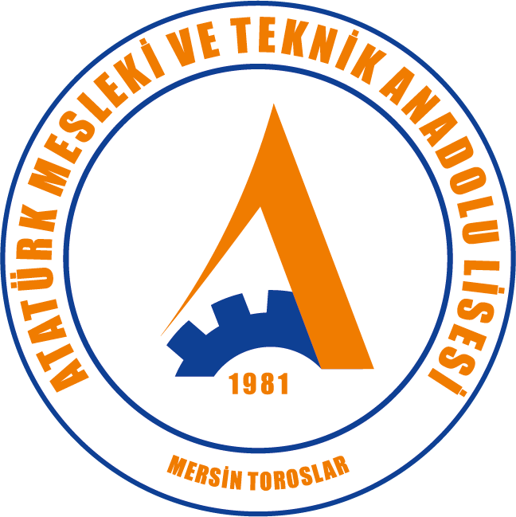

<p align="center">
  
</p>

<h1 align="center">MESNET.Lite</h1>

<p align="center">
  İşletmelerde mesleki eğitim (İME) koordinatörlük dağıtımı, ek ders saati takdiri ve değişiklik tarihçesi için masaüstü uygulaması.<br>
  Atatürk Mesleki ve Teknik Anadolu Lisesi — Mersin / Toroslar
</p>

<p align="center">
  <a href="https://github.com/Ataturk-MTAL/mesnet-lite/actions/workflows/ci.yml"></a>
  <a href="LICENSE"></a>
</p>

## Özellikler

- **İşletmeler ve öğrenciler** — JotForm CSV ve e-Okul öğrenci listesi içe aktarımı, mükerrer işletme birleştirme.
- **Ek ders saati takdiri** — havuz ve tavan kurallarıyla otomatik dağıtım, satır kilitleme.
- **Koordinatör dağıtımı** — öğretmen programı ve ders yüküne göre ziyaret planı.
- **Değişiklik tarihçesi** — her değişiklik yürürlük tarihiyle kaydedilir; aynı ay içinde geriye dönük düzeltme sonraki kayıtları ezer, etkisiz kayıtlar tarihçeden silinebilir.
- **Raporlar** — görevlendirme çizelgesi, ziyaret listeleri, komisyon tutanakları (PDF / Excel).
- **Yedekleme** — her açılışta günlük otomatik yedek (son 14), elle yedek alma ve yedekten geri yükleme.
- **Çok kullanıcılı giriş** — PIN ile giriş; tarihçe her değişikliği yapanın adıyla tutar.

Veriler yalnız kendi bilgisayarınızda, yerel bir SQLite dosyasında tutulur; hiçbir sunucuya gönderilmez.

## Kurulum

[Sürümler](https://github.com/Ataturk-MTAL/mesnet-lite/releases) sayfasından işletim sisteminize uygun paketi indirin:

| Platform | Dosya |
|---|---|
| Windows | `.msi` ya da `-setup.exe` |
| macOS (Apple Silicon / Intel) | `.dmg` |
| Linux | `.AppImage`, `.deb` ya da `.rpm` |

macOS paketleri imzasızdır; ilk açılışta uygulamaya sağ tıklayıp **Aç** seçin.

## Geliştirme

Gereksinimler: Node.js 22+, pnpm, Rust (stable) ve [Tauri önkoşulları](https://tauri.app/start/prerequisites/).

```bash
pnpm install
pnpm tauri dev          # uygulamayı geliştirme modunda açar
pnpm exec vitest run    # arayüz testleri
cd src-tauri && cargo test   # arka uç testleri
pnpm tauri build        # kurulum paketi üretir
```

Yapı: `src/` Vue 3 + TypeScript + OpenVue arayüzü, `src-tauri/` Rust arka ucu (sqlx + SQLite, olay tabanlı değişiklik günlüğü).

## Sürüm çıkarma

`src-tauri/tauri.conf.json` ve `package.json` içindeki sürümü artırın, sonra etiket gönderin:

```bash
git tag v0.2.0 && git push origin v0.2.0
```

GitHub Actions Windows, macOS ve Linux kurulum dosyalarını derleyip sürümü yayınlar.

## Gizlilik

Tüm veriler yalnız kendi bilgisayarınızdaki yerel SQLite dosyasında tutulur; uygulama telemetri toplamaz, hesap açmaz, verilerinizi hiçbir sunucuya göndermez. Yalnız **kullanıcı açıkça istediğinde** iki ağ bağlantısı kurulur:

- **Konum bulma** (İşletmeler → "Konum Bul"): işletme adresleri koordinat için [OpenStreetMap Nominatim](https://nominatim.org/)'e gönderilir.
- **Konum haritası** (işletme konumunu haritada seçme): harita görüntüleri [OpenStreetMap](https://www.openstreetmap.org/) karo sunucusundan indirilir.

> This program will not transfer any information to other networked systems unless specifically requested by the user.

Kaldırma: Windows'ta *Ayarlar → Uygulamalar*, macOS'ta uygulamayı Çöp Kutusu'na taşıma, Linux'ta paket yöneticisi. Veriler ayrı klasörde kalır (Windows: `%APPDATA%\ai.alplab.mesnet-lite`, macOS: `~/Library/Application Support/ai.alplab.mesnet-lite`, Linux: `~/.local/share/ai.alplab.mesnet-lite`); tamamen silmek için bu klasörü de silin.

## Code signing policy

Free code signing provided by [SignPath.io](https://about.signpath.io/), certificate by [SignPath Foundation](https://signpath.org/).

Windows installers are built from this repository's source by GitHub Actions ([`release.yml`](.github/workflows/release.yml)) and signed only after a manual approval.

> Durum: SignPath Foundation başvurusu aşamasında. Onaydan önceki sürümler (`v0.1.0`) imzasızdır.

| Role | Members |
|---|---|
| Committers and reviewers | [@hkngln](https://github.com/hkngln) |
| Approvers | [@hkngln](https://github.com/hkngln) |

All team members use multi-factor authentication for GitHub and SignPath. Privacy: see [Gizlilik](#gizlilik) above.

## Yazar

**Hakan Gülen** — [@hkngln](https://github.com/hkngln)

## Lisans

Copyright © 2026 Hakan Gülen. Kaynak kod [Apache License 2.0](LICENSE) ile lisanslanmıştır.
Okul amblemi Atatürk Mesleki ve Teknik Anadolu Lisesi'ne aittir ve bu lisans kapsamında **değildir** — ayrıntılar için [NOTICE](NOTICE).
