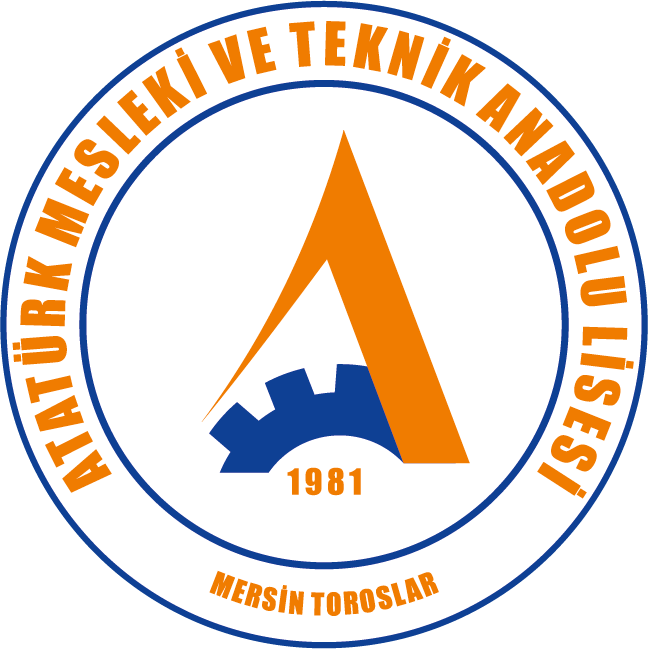

<p align="center">
  
</p>

<h1 align="center">MESNET.Lite</h1>

<p align="center">
  İşletmelerde mesleki eğitim (İME) koordinatörlük dağıtımı, ek ders saati takdiri ve değişiklik tarihçesi için masaüstü uygulaması.<br>
  Atatürk Mesleki ve Teknik Anadolu Lisesi — Mersin / Toroslar
</p>

<p align="center">
  <a href="https://github.com/Ataturk-MTAL/mesnet-lite/actions/workflows/ci.yml"></a>
  <a href="LICENSE"></a>
</p>

## Özellikler

- **İşletmeler ve öğrenciler** — JotForm CSV ve e-Okul öğrenci listesi içe aktarımı, mükerrer işletme birleştirme.
- **Ek ders saati takdiri** — havuz ve tavan kurallarıyla otomatik dağıtım, satır kilitleme.
- **Koordinatör dağıtımı** — öğretmen programı ve ders yüküne göre ziyaret planı.
- **Değişiklik tarihçesi** — her değişiklik yürürlük tarihiyle kaydedilir; aynı ay içinde geriye dönük düzeltme sonraki kayıtları ezer, etkisiz kayıtlar tarihçeden silinebilir.
- **Raporlar** — görevlendirme çizelgesi, ziyaret listeleri, komisyon tutanakları (PDF / Excel).
- **Yedekleme** — her açılışta günlük otomatik yedek (son 14), elle yedek alma ve yedekten geri yükleme.
- **Çok kullanıcılı giriş** — PIN ile giriş; tarihçe her değişikliği yapanın adıyla tutar.

Veriler yalnız kendi bilgisayarınızda, yerel bir SQLite dosyasında tutulur; hiçbir sunucuya gönderilmez.

## Kurulum

[Sürümler](https://github.com/Ataturk-MTAL/mesnet-lite/releases) sayfasından işletim sisteminize uygun paketi indirin:

| Platform | Dosya |
|---|---|
| Windows | `.msi` ya da `-setup.exe` |
| macOS (Apple Silicon / Intel) | `.dmg` |
| Linux | `.AppImage`, `.deb` ya da `.rpm` |

### Windows: kurulum ve antivirüs uyarısı

Kurulum **yönetici olarak** yapılır (Program Files altına, bilgisayardaki tüm kullanıcılar için); kurulum başlarken Windows yönetici izni ister.

Kurulum dosyaları **dijital olarak imzalı değildir**. Bu yüzden:

- **Windows SmartScreen** "Windows bilgisayarınızı korudu" diyebilir → **Ek bilgi → Yine de çalıştır**.
- **Avast, AVG vb.** dosyayı şüpheli sayıp engelleyebilir. Bu bir **yanlış alarmdır (false positive)**: dosyalar bu depodaki açık kaynak koddan GitHub Actions ile otomatik derlenir; imzasız, yeni ve az indirilmiş kurulum dosyaları sezgisel olarak işaretlenir.
  1. Antivirüsün karantinasında MESNET.Lite dosyası varsa geri yükleyin ya da silin.
  2. İndirilen kurulum dosyasını antivirüsün **İstisnalar** listesine ekleyin (Avast: *Menü → Ayarlar → Genel → İstisnalar*).
  3. Önceki yarım kalmış kurulum varsa *Ayarlar → Uygulamalar*'dan kaldırın, kurulum dosyasını **yeniden indirip** çalıştırın.
- Dosyanın bu depodan geldiğini doğrulamak için Sürümler sayfasında her dosyanın yanında gösterilen **SHA-256** özetini kontrol edebilirsiniz: `Get-FileHash .\MESNET.Lite_*_x64-setup.exe`.
- Yanlış alarmı bildirmek: [Avast](https://www.avast.com/false-positive-file-form.php) · [Microsoft Defender](https://www.microsoft.com/en-us/wdsi/filesubmission).

macOS paketleri de imzasızdır; ilk açılışta uygulamaya sağ tıklayıp **Aç** seçin.

## Geliştirme

Gereksinimler: Node.js 22+, pnpm, Rust (stable) ve [Tauri önkoşulları](https://tauri.app/start/prerequisites/).

```bash
pnpm install
pnpm tauri dev          # uygulamayı geliştirme modunda açar
pnpm exec vitest run    # arayüz testleri
cd src-tauri && cargo test   # arka uç testleri
pnpm tauri build        # kurulum paketi üretir
```

Yapı: `src/` Vue 3 + TypeScript + OpenVue arayüzü, `src-tauri/` Rust arka ucu (sqlx + SQLite, olay tabanlı değişiklik günlüğü).

## Sürüm çıkarma

`package.json`, `src-tauri/Cargo.toml` ve `src-tauri/tauri.conf.json` içindeki sürümü artırın, `release-notes/X.Y.Z.md` dosyasına sürüm notlarını yazın ve değişikliği `dev` üzerinden `main`'e PR ile birleştirin.

`main`'e gelen push GitHub Actions'ta `Sürüm` iş akışını başlatır: Windows, macOS, Linux ve MSIX paketleri derlenir, sürüm yayımlanır ve `vX.Y.Z` etiketi kendiliğinden oluşur. Elle etiket gönderilmez. Ayrıntı: [CONTRIBUTING.md](CONTRIBUTING.md#sürüm-çıkarma).

## Gizlilik

Tüm veriler yalnız kendi bilgisayarınızdaki yerel SQLite dosyasında tutulur; uygulama telemetri toplamaz, hesap açmaz, verilerinizi hiçbir sunucuya göndermez. Yalnız **kullanıcı açıkça istediğinde** iki ağ bağlantısı kurulur:

- **Konum bulma** (İşletmeler → "Konum Bul"): işletme adresleri koordinat için [OpenStreetMap Nominatim](https://nominatim.org/)'e gönderilir.
- **Konum haritası** (işletme konumunu haritada seçme): harita görüntüleri [OpenStreetMap](https://www.openstreetmap.org/) karo sunucusundan indirilir.

> This program will not transfer any information to other networked systems unless specifically requested by the user.

Kaldırma: Windows'ta *Ayarlar → Uygulamalar*, macOS'ta uygulamayı Çöp Kutusu'na taşıma, Linux'ta paket yöneticisi. Veriler ayrı klasörde kalır (Windows: `%APPDATA%\org.ataturkmtal.mesnet-lite`, macOS: `~/Library/Application Support/org.ataturkmtal.mesnet-lite`, Linux: `~/.local/share/org.ataturkmtal.mesnet-lite`); tamamen silmek için bu klasörü de silin. 0.1.5 öncesi sürümler verileri `ai.alplab.mesnet-lite` adlı klasörde tutuyordu; 0.1.5 ilk açılışta bunları yeni klasöre kopyalar ve eski klasörü yedek olarak yerinde bırakır — yeni sürümde verilerinizin tam olduğunu gördükten sonra eski klasörü silebilirsiniz.

## Yazar

**Hakan Gülen** — [@hkngln](https://github.com/hkngln)

## Lisans

Copyright © 2026 Hakan Gülen. Kaynak kod [Apache License 2.0](LICENSE) ile lisanslanmıştır.
Okul amblemi Atatürk Mesleki ve Teknik Anadolu Lisesi'ne aittir ve bu lisans kapsamında **değildir** — ayrıntılar için [NOTICE](NOTICE).
